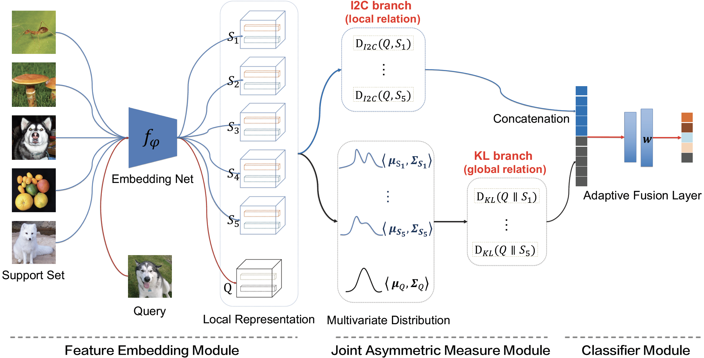
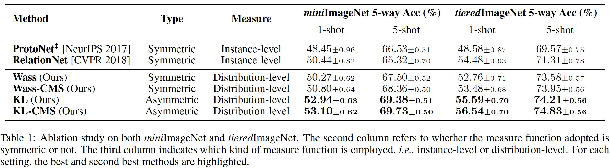
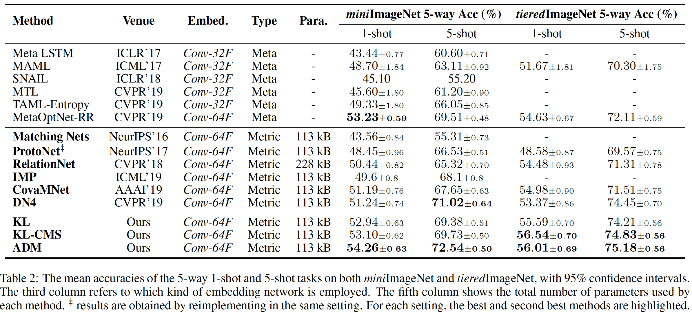

# ADM in PyTorch

We provide a PyTorch implementation of ADM for few-shot learning. 
If you use this code for your research, please cite our paper.
```
@inproceedings{li2020ADM,
  title={Asymmetric Distribution Measure for Few-shot Learning},
  author={Li, Wenbin and Wang, Lei and Huo, Jing and Shi, Yinghuan and Gao, Yang and Luo, Jiebo},
  booktitle={IJCAI},
  year={2020}
}
```
[Asymmetric Distribution Measure for Few-shot Learning](https://www.ijcai.org/Proceedings/2020/0409.pdf).<br> 
[Wenbin Li](https://cs.nju.edu.cn/liwenbin/), Lei Wang, Jing Huo, Yinghuan Shi, Yang Gao and Jiebo Luo. In IJCAI 2020.<br> 



## Prerequisites
- Linux
- Python 3.5
- Pytorch 1.3
- GPU + CUDA CuDNN
- pillow, torchvision, scipy, numpy

## Getting Started
### Installation

- Clone this repo:
```bash
git clone https://github.com/WenbinLee/ADM.git
cd ADM
```

- Install [PyTorch](http://pytorch.org) 1.3 and other dependencies.

### Datasets
- [miniImageNet](https://www.dropbox.com/sh/6yd1ygtyc3yd981/AABVeEqzC08YQv4UZk7lNHvya?dl=0)(The used data splits can be seen ADM/dataset/miniImageNet). 
- [tieredImageNet](https://www.dropbox.com/sh/6yd1ygtyc3yd981/AABVeEqzC08YQv4UZk7lNHvya?dl=0)(The used data splits can be seen ADM/dataset/tieredImageNet).<br> 
  Note that all the images need to be stored into a file named "images", and the data splits are stored into "train.csv", "val.csv" and "test.csv", respectively.


###  miniImageNet Few-shot Classification with Data Augmentation
- Train a 5-way 1-shot model based on Conv64F:
```bash
python Train_Batch_miniImageNet.py --dataset_dir ./datasets/miniImageNet --method_name KL --way_num 5 --shot_num 1
```
- Test the model (specify the dataset_dir first):
```bash
python Test_Batch.py --resume ./results/miniImageNet_DA/KL_BatchSize_4_Conv64F_miniImageNet_5Way_1Shot/model_best.pth.tar --data_name miniImageNet --method_name KL --way_num 5 --shot_num 1
```

###  tieredImageNet Few-shot Classification without Data Augmentation
- Train a 5-way 1-shot model based on Conv64F:
```bash
python Train_Batch_miniImageNet.py --dataset_dir ./datasets/tieredImageNet --method_name KL --way_num 5 --shot_num 1
```
- Test the model (specify the dataset_dir first):
```bash
python Test_Batch.py --resume ./results/tieredImageNet_NoDA/KL_BatchSize_4_Conv64F_tieredImageNet_5Way_1Shot/model_best.pth.tar --data_name miniImageNet --method_name KL --way_num 5 --shot_num 1
```

- The results on the miniImageNet and tieredImageNet datasets: 




## Citation
If you use this code for your research, please cite our paper.
```
@inproceedings{li2020ADM,
  title={Asymmetric Distribution Measure for Few-shot Learning},
  author={Li, Wenbin and Wang, Lei and Huo, Jing and Shi, Yinghuan and Gao, Yang and Luo, Jiebo},
  booktitle={IJCAI},
  year={2020}
}
```
